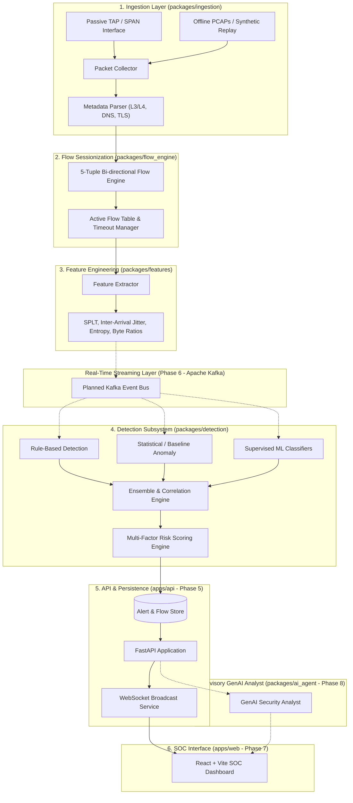

# SentinelAI — System Architecture Blueprint

## 1. Architectural Mission & Invariants

SentinelAI is a passive network threat detection and Security Operations Center (SOC) intelligence platform engineered for **SIH 2026 Problem 145**. Its core objective is to detect advanced cyber attacks across enterprise networks with minimal false positives, high throughput, and zero disruption to monitored systems.

### 🔒 Mandatory Passive-Security Invariant
```
"The SentinelAI detection pipeline is strictly passive. No component may transmit packets,
perform active probing, complete network handshakes, block traffic, or decrypt application payloads."
```

This invariant enforces the following design rules across all modules:
1. **Network Interface Safety:** Ingestion collectors bind exclusively to raw capture interfaces (promiscuous SPAN/TAP) in read-only mode, or process offline PCAP files.
2. **Zero In-Band Transmission:** No TCP resets, RST packets, ICMP unreachable messages, or active DNS lookups are sent back to observed hosts.
3. **Payload Privacy & Zero-Decryption:** Cryptographic payloads remain uninspected. Classification uses TLS handshake metadata (SNI, cipher suites, JA3/JA4 fingerprints), packet size/length sequences (SPLT), and timing dynamics.

---

## 2. High-Level System Architecture



---

## 3. Package Architecture & Separation of Concerns

The codebase is partitioned into distinct, independently testable Python packages under `packages/` alongside application services under `apps/`:

### 3.1 `packages/models`
- **Responsibility:** Canonical domain models, protocol event schemas, alert structures, and telemetry metrics.
- **Key Schemas:**
  - `PacketMetadata`: Timestamp, source/destination IP, ports, protocol, payload length, TCP flags, DNS query/record metadata, TLS handshake details.
  - `FlowRecord`: Bi-directional 5-tuple session, duration, packet counts, byte counts, inter-arrival time distributions, TCP state flags.
  - `Alert`: Unique ID, timestamp, threat category, severity, confidence, risk score, MITRE ATT&CK technique IDs, evidence payload, explainability reasoning.
  - `TelemetryMetrics`: Packet throughput, flow throughput, detection latency.
- **Dependencies:** `pydantic` only.

### 3.2 `packages/ingestion`
- **Responsibility:** Passive capture from live interfaces or PCAP files; header parsing into `PacketMetadata`.
- **Constraint:** Strictly read-only, non-blocking, zero packet transmission.
- **Phases:** Phase 1 (Core parsers) & Phase 10 (Hardware acceleration if needed).

### 3.3 `packages/flow_engine`
- **Responsibility:** Aggregating raw packets into bi-directional 5-tuple flows (`(src_ip, src_port, dst_ip, dst_port, protocol)`).
- **Core Mechanics:** Sliding window expiration, active/inactive timeouts, TCP state machine tracking (SYN -> ESTABLISHED -> FIN/RST).
- **Dependencies:** `packages/models`.

### 3.4 `packages/features`
- **Responsibility:** Computing statistical features and behavioral signals over completed and in-flight flows.
- **Feature Sets:**
  - **SPLT (Sequence of Packet Lengths and Times):** Captures traffic rhythm and message sizes without decrypting payloads.
  - **Inter-Arrival Jitter:** Standard deviation and autocorrelation of inter-packet delays (vital for C2 beaconing detection).
  - **Entropy Analysis:** Shannon entropy of domain names (DNS DGA) and flow byte frequencies.
  - **Directional Byte/Packet Asymmetry:** Outbound-to-inbound volume ratios (vital for exfiltration).

### 3.5 `packages/detection`
Maintains strict internal separation between detection strategies to ensure independent testability:

```
packages/detection/sentinel_detection/
├── base.py              # BaseDetector abstract interface
├── rules/               # Deterministic signature & threshold rules (Port scan, SYN flood)
├── statistical/         # Baseline profiling, Z-score outliers, Shannon entropy
├── ml/                  # Supervised ML inference (Random Forest / XGBoost models)
├── correlation/         # Multi-signal correlation, deduplication & attack graph linking
└── scoring/             # Composite risk score calculation (0 - 100)
```

- **Rules Engine:** Fast deterministic matching for well-defined threat signatures (e.g., failed TCP connection thresholds for port scans, volumetric bursts for DDoS).
- **Statistical Engine:** Baseline tracking per host/subnet using moving averages and standard deviations. Detects behavioral drift without prior attack labels.
- **Supervised ML:** Pre-trained lightweight tabular models evaluated on extracted feature vectors for encrypted flow and C2 classification.
- **Correlation Engine:** Aggregates findings from rules, statistical models, and ML. Prevents alert storms by fusing related signals into unified incidents.
- **Risk Scoring Engine:** Computes an explainable 0–100 risk score based on detection confidence, asset criticality, attack severity, and multi-stage indicators.

### 3.6 `packages/ai_agent` (Advisory GenAI Security Analyst)
- **Role:** Strictly an **advisory and investigative assistant**.
- **Crucial Rule:** The GenAI agent **must never be the authoritative threat classifier**. Primary detection is executed entirely by `packages/detection`.
- **Functions:**
  - Generating plain-English incident summaries for SOC operators.
  - Explaining detection evidence and MITRE ATT&CK technique context.
  - Suggesting passive containment and firewall-rule playbooks for human analysts to review.

---

## 4. Planned Real-Time Streaming Architecture (Phase 6)

In **Phase 6**, Apache Kafka will be introduced as the distributed, decoupled streaming backbone:

- `sentinel.packets.raw`: Ingested packet metadata stream (partitioned by flow hash).
- `sentinel.flows.aggregated`: Assembled flow records with computed feature vectors.
- `sentinel.alerts.high`: Correlated, risk-scored alerts consumed by the FastAPI server and WebSocket hub.

> *Note: Phase 0 intentionally avoids running or requiring Kafka.* Local in-memory queues and generator pipelines are utilized in earlier phases to keep development agile and lightweight.

---

## 5. Performance & Telemetry Architecture

SentinelAI defines three primary performance metrics that must be continuously measured and validated:

1. **Packet Ingestion Throughput:**
   $$\text{Throughput}_{\text{pkt}} = \frac{\Delta \text{Packets Ingested}}{\Delta t} \quad (\text{target: } \ge 50,000 \text{ pkts/sec offline, } \ge 10,000 \text{ pkts/sec single-core live})$$
2. **Flow Processing Throughput:**
   $$\text{Throughput}_{\text{flow}} = \frac{\Delta \text{Flows Processed}}{\Delta t} \quad (\text{target: } \ge 5,000 \text{ flows/sec})$$
3. **End-to-End Detection Latency:**
   $$\text{Latency}_{\text{e2e}} = t_{\text{alert\_emitted}} - t_{\text{last\_packet\_timestamp}} \quad (\text{target: } < 100\text{ ms for rule/stat, } < 500\text{ ms for ML})$$

---

## 6. Threat Coverage & MITRE ATT&CK Alignment

| Threat Category | Primary Detection Strategy | Feature / Metadata Signals | MITRE Technique |
| :--- | :--- | :--- | :--- |
| **DDoS (Volumetric & State)** | Rules + Statistical Baseline | High packet rates, SYN flag ratio, asymmetric UDP/ICMP | T1498 (Network DoS) |
| **Port & Network Scans** | Rules (Failed Connection Tracking) | SYN/RST ratio, destination port entropy, short duration | T1046 (Network Service Discovery) |
| **C2 Beaconing** | Statistical (Jitter & Autocorrelation) | Low inter-arrival variance, uniform packet sizes, periodic intervals | T1071 (Application Layer Protocol) |
| **DNS DGA & Tunneling** | Statistical (Entropy) + Rules | High Shannon entropy, excessive TXT queries, high request rates | T1568.002 (DGA), T1071.004 (DNS) |
| **Suspicious Encrypted Flows** | Supervised ML + Fingerprinting | JA3/JA4 hashes, SPLT patterns, TLS extension anomalies | T1573 (Encrypted Channel) |
| **Data Exfiltration** | Statistical + Rule Thresholds | High outbound byte ratio, unusual protocol usage, burst volume | T1048 (Exfiltration Over Alternative Protocol) |
| **Behavioral Anomaly** | Statistical Moving Baselines | Deviation from host baseline (new ports, unusual hours, high volume) | T1078 (Valid Accounts / Abuse) |

---

## 7. Solo-Developer Maintenance Principles

To ensure this architecture remains manageable for a solo developer:
- **Clean Interface Boundaries:** Every package communicates via typed `sentinel_models` Pydantic schemas.
- **No Monolithic Interdependencies:** The detection engine has zero direct dependency on how packets were captured (PCAP, live interface, or mock generator).
- **Deferred Infrastructure:** Heavy components (distributed brokers, time-series databases, GPU-based ML) are deferred until strictly required by their respective roadmap phases.
- **Comprehensive Unit Testing:** Each module can be developed and validated in a standalone Python virtual environment.
