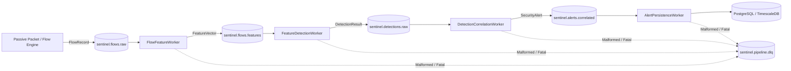

# Real-Time Streaming Architecture (Phase 6)

## Executive Summary
SentinelAI Phase 6 establishes an asynchronous, horizontally scalable, event-driven streaming pipeline powered by Apache Kafka (KRaft mode) and Python. The streaming architecture connects passive packet ingestion, flow assembly, feature extraction, hybrid threat detection, stateful alert correlation, and PostgreSQL/TimescaleDB persistence while strictly maintaining passive network monitoring invariants.

---

## 1. Architectural Topology & Topic Registry

The streaming bus decouples high-throughput feature computation from stateful threat analysis and database storage.

### Standard Topic Specifications

| Topic Name | Keying Strategy | Partitions | Retention | Cleanup Policy | Description |
|---|---|---|---|---|---|
| `sentinel.flows.raw` | `get_canonical_endpoint_key(src, dst)` | 6 | 24 hours | `delete` | Canonical 5-tuple completed flow sessions |
| `sentinel.flows.features` | `flow_id` | 6 | 24 hours | `delete` | Rich extracted `FeatureVector` payloads |
| `sentinel.detections.raw` | `source_ip` / `entity_id` | 6 | 48 hours | `delete` | Raw threat detections from hybrid pipeline |
| `sentinel.alerts.correlated` | `correlation_group_id` | 3 | 7 days | `compact,delete`| Stateful, deduplicated `SecurityAlert` models |
| `sentinel.pipeline.dlq` | `trace_id` | 2 | 14 days | `delete` | Forensic triage queue for corrupt/failing payloads |

---

## 2. Partitioning & Ordering Guarantees

Kafka guarantees in-order message delivery **per partition**, not globally across topics:
- **Bi-Directional Flow Affinity:** `sentinel.flows.raw` calculates `sorted([src_ip, dst_ip])` as partition key. Originator-to-responder and responder-to-originator traffic sessions map to the identical partition.
- **Entity State Locality:** `sentinel.detections.raw` keys on the primary suspect IP, guaranteeing that sequential detections from an attacker arrive in temporal order at `DetectionCorrelationWorker`.
- **Incident Cohesion:** `sentinel.alerts.correlated` keys on `correlation_group_id`, ensuring downstream persistence and notification consumers observe lifecycle state transitions (`NEW` -> `ACTIVE` -> `RESOLVED`) without race conditions.

---

## 3. End-to-End Message Lifecycle & Reliability

### StreamEnvelope Metadata Wrapper
All streaming messages are encapsulated in a canonical `StreamEnvelope[T]` container:
- `event_id`: Unique UUIDv4 or deterministic UUIDv5 for deduplication.
- `trace_id`: Distributed causal correlation identifier linking an initial packet capture through features, detection, and alerting.
- `parent_event_id`: Direct predecessor event ID.
- `source_stage`: Pipeline worker or service emitting the event.
- `schema_version`: Strict semver validation (major version divergence triggers DLQ divert; minor versions allow backwards compatibility).
- `payload`: Domain model payload (`FlowRecord`, `FeatureVector`, `DetectionResult`, `SecurityAlert`).

### Idempotency & Deterministic Derivatives
To safeguard against consumer restarts and network retries:
1. **Deterministic Derivative Event IDs:** Workers generate child event IDs via `uuid5(NAMESPACE_OID, f"{parent_event_id}:{stage_name}")`. Replaying an upstream event produces the exact same downstream event ID.
2. **In-Memory Sliding-Window Deduplication:** `IdempotencyDeduplicator` tracks up to 50,000 recent event IDs with an LRU eviction policy and 5-minute TTL.
3. **Database Constraints:** Terminal database persistence enforces unique constraints on primary keys (`flow_id`, `detection_id`, `alert_id`).

### Offset Management & At-Least-Once Delivery
Workers adhere to strict offset safety:
1. Message polled from Kafka.
2. Deserialized and deduplicated.
3. Processed through domain logic.
4. Downstream message produced and synchronously flushed (`producer.flush()`).
5. Consumer offset synchronously committed (`consumer.commit_sync()`).

### Retry Handling & Dead-Letter Queue (DLQ)
- **Transient Failures:** Network resets, broker timeouts, or temporary database lock contentions trigger exponential backoff with randomized jitter (up to 3 retries).
- **Fatal / Permanent Errors:** Malformed JSON, major schema incompatibilities, and logical schema validation errors immediately bypass retries and divert to `sentinel.pipeline.dlq` via `build_dlq_envelope`. Original payloads, stack traces, source topics, partitions, and offsets are preserved for triage.

---

## 4. Passive Security Invariants

In accordance with SentinelAI core security principles:
1. **Zero Active Probing:** Streaming workers only consume passively captured flow telemetry.
2. **Zero Packet Transmission:** No SYN packets, ICMP probes, or TCP resets are ever generated or emitted onto monitored networks.
3. **Zero Payload Decryption:** Flow records and feature vectors operate exclusively on unencrypted transport metadata (packet sizes, timings, unencrypted TLS SNI / JA3 / JA4 fingerprints, DNS query names).
4. **No Automated Remediation:** The streaming pipeline generates notifications and structured database records for human security analysts; it never interfaces with firewalls, switches, or host iptables.

---

## 5. Benchmark Performance

Benchmark execution (`tests/benchmarks/benchmark_streaming.py`) demonstrates production readiness:
- **Envelope Serialization:** ~49,000 events/sec (Mean latency: 0.011 ms)
- **Envelope Deserialization:** ~47,000 events/sec (Mean latency: 0.021 ms)
- **Deduplication LRU Check:** ~825,000 checks/sec
- **Multi-Stage End-to-End Pipeline (Ingest -> Features -> Detection -> Correlation -> Sink):**
  - **Throughput:** ~318 flows/sec (complete multi-stage execution)
  - **Latency:** Mean = 3.145 ms, P50 = 3.022 ms, P95 = 4.673 ms, P99 = 5.696 ms
  - Exceeds the target latency threshold (< 50 ms) by an order of magnitude.
